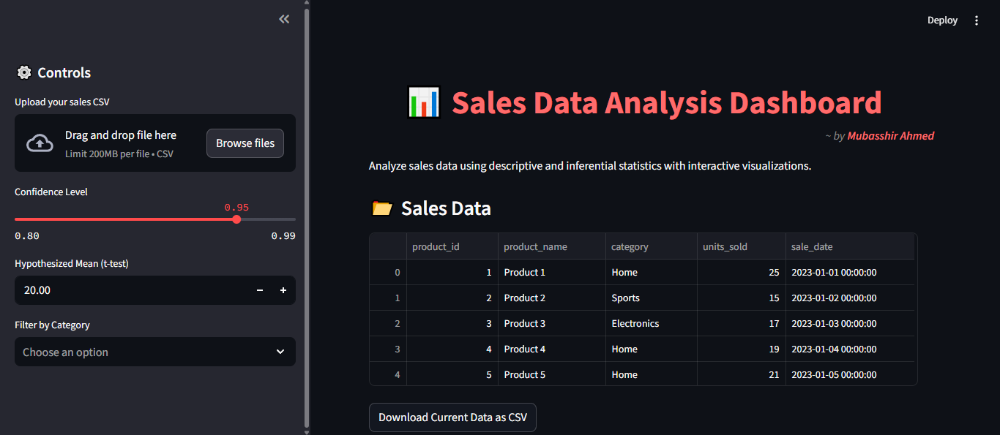
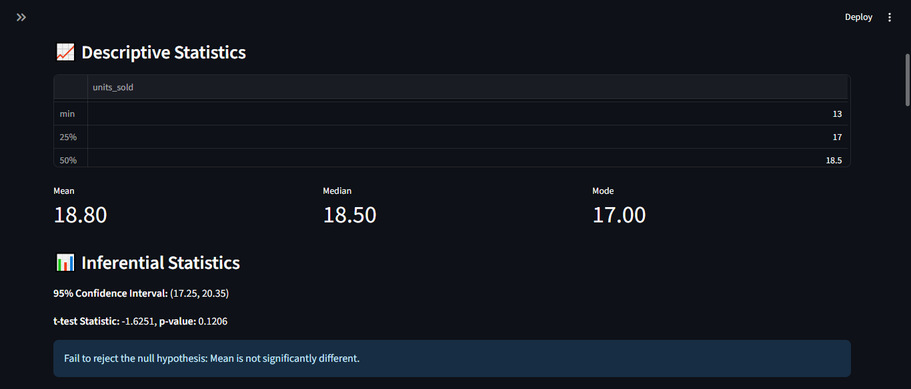
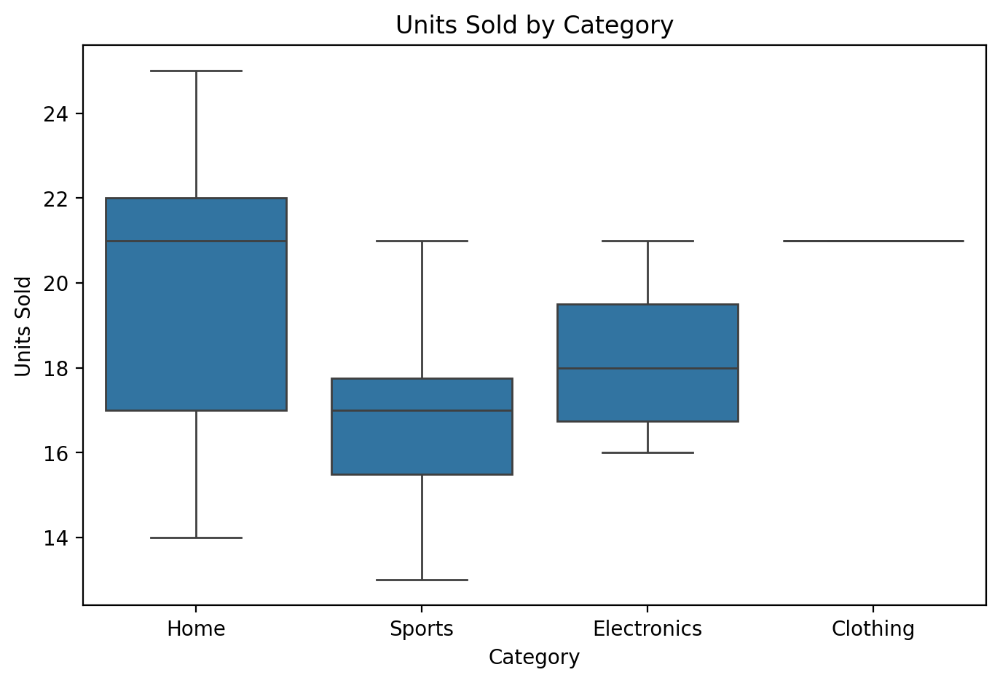
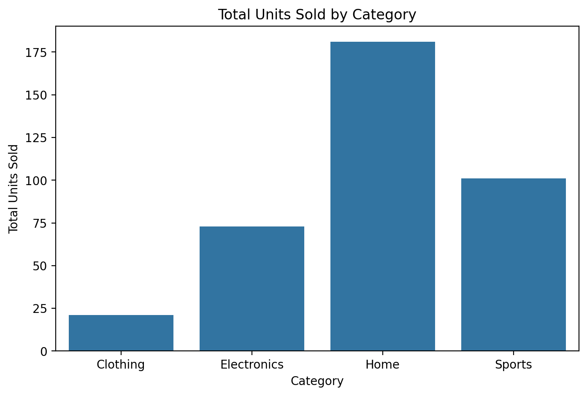

# 📊 Sales Data Statistical Analysis

**End-to-End Statistical Analysis on Real-World Sales Data**
Clean, industry-grade code with rich visualizations, inferential insights, and an interactive dashboard.

---

## 📌 Project Overview

This repository showcases a complete **statistical analysis workflow** for sales data, applying both descriptive and inferential methods. It is built with **best practices** in mind for data analytics portfolios.

### Key Capabilities

- **Descriptive Statistics** — Mean, Median, Mode, Standard Deviation
- **Inferential Statistics** — Confidence Intervals, Hypothesis Testing
- **Data Visualization** — Histograms, Boxplots, Bar Charts
- **Interactive Exploration** — Streamlit-powered dashboard for real-time insights

---

## 🗂 Repository Structure

```
sales-data-statistical-analysis/
├── dataset/
│   └── sales_data.csv
├── app.py                         # Streamlit dashboard
├── Sales_Data_Analysis_Mubasshir_Ahmed.ipynb   # Detailed Jupyter Notebook analysis
└── Sales Data Analysis ~ Mubasshir Ahmed.pdf   # Notebook export as PDF
```

---

## 🚀 Features

✅ Generate or upload custom sales datasets
✅ Perform **comprehensive statistical analysis**
✅ Create **publication-quality visualizations**
✅ Use an **interactive Streamlit dashboard** for exploration
✅ Download **cleaned data & insights**

---

## 🛠 Tech Stack

- **Python 3.10+**
- **Pandas** — Data manipulation
- **NumPy** — Numerical computations
- **SciPy** — Statistical testing
- **Matplotlib** / **Seaborn** — Visualization
- **Streamlit** — Interactive web app

---

## 📥 Installation & Usage

### 1️⃣ Clone the Repository

```bash
git clone https://github.com/mubasshirahmed-3712/sales-data-statistical-analysis.git
cd sales-data-statistical-analysis
```

### 2️⃣ Install Dependencies

```bash
pip install -r requirements.txt
```

### 3️⃣ Run the Notebook

```bash
jupyter notebook Sales_Data_Analysis_Mubasshir_Ahmed.ipynb
```

### 4️⃣ Launch the Streamlit App

```bash
streamlit run app.py
```

---

## 📸 Screenshots

>
> <p align="center">
>   <br>
>   <br>
>   <br>
>   <br>
>   
> </p>
>

---

## 👨‍💻 Developer

**Mubasshir Ahmed**
🧠 Data & AI Enthusiast | Python • SQL • ML • GenAI • BI Tools
💼 [LinkedIn](#) | 🐙 [GitHub](#) | 🌐 [Portfolio](#)

---

## 📜 License

This project is open-source under the **MIT License**.
